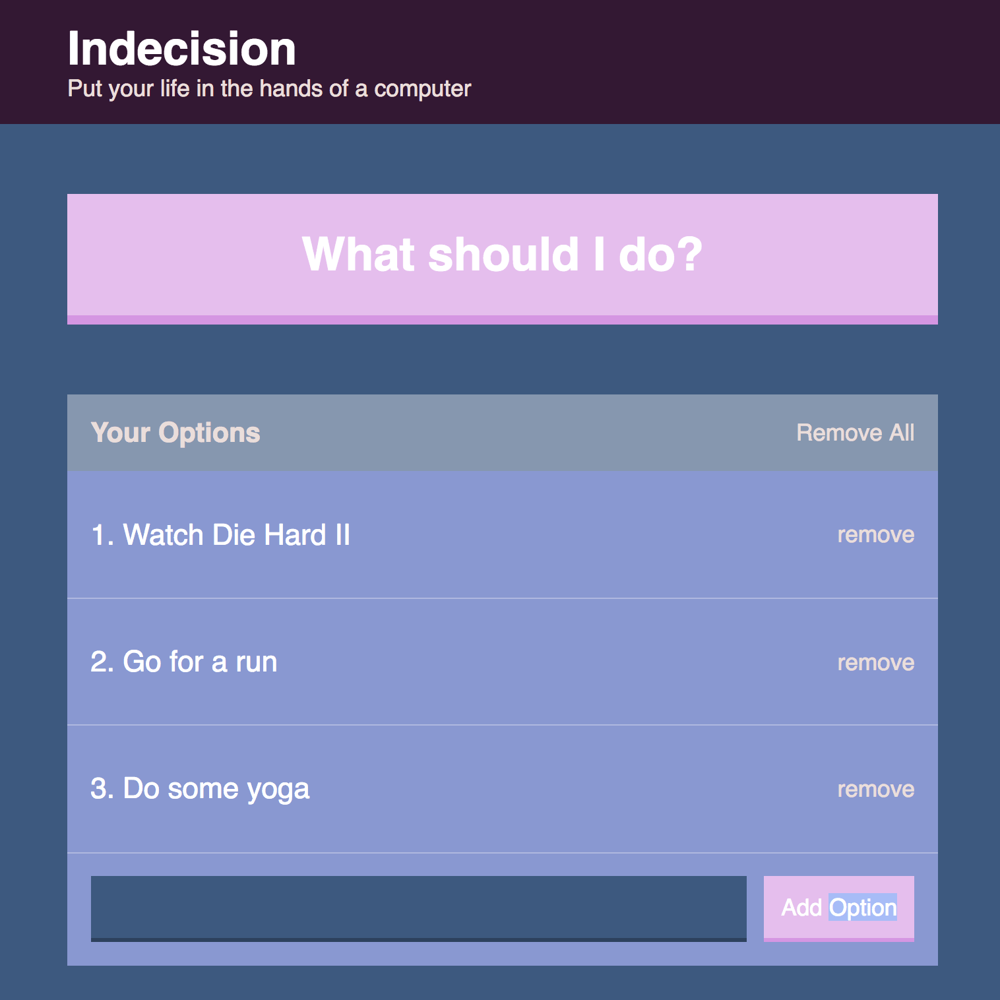
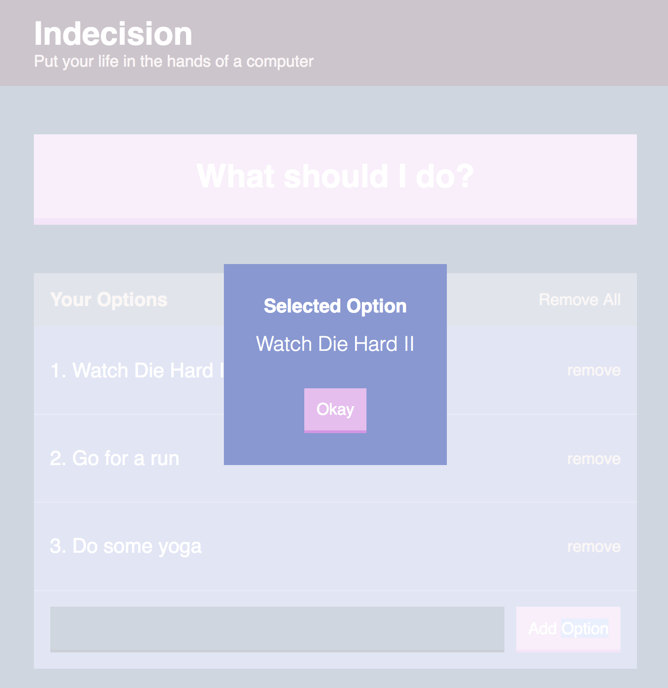
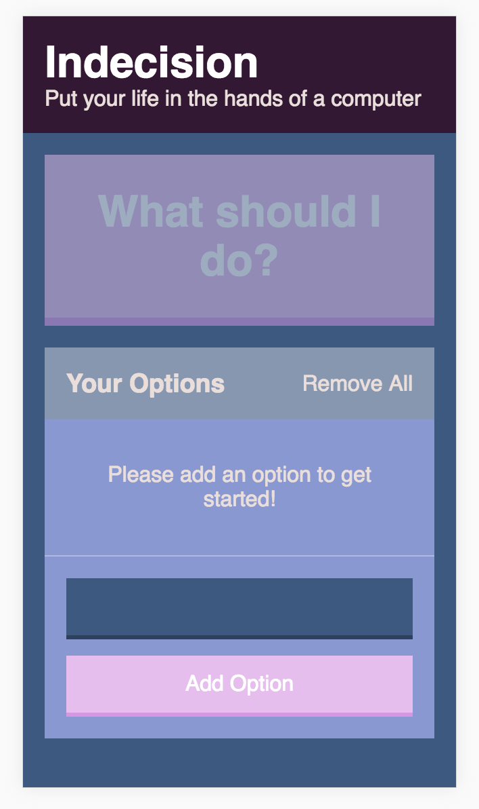

# Indecision App
A simple React app built using Webkit, css-loaders, Babel and Sass.

To run:
- Clone this repo
- install packages
- run `yarn run dev-server`
- go to localhost

- Add an item
- Add another
- Click the 'What should I do?' button
- Let the programme decide what you do!

### React / Webkit / Sass  

### Desktop View
  

 

### Mobile View using Flexbox
 